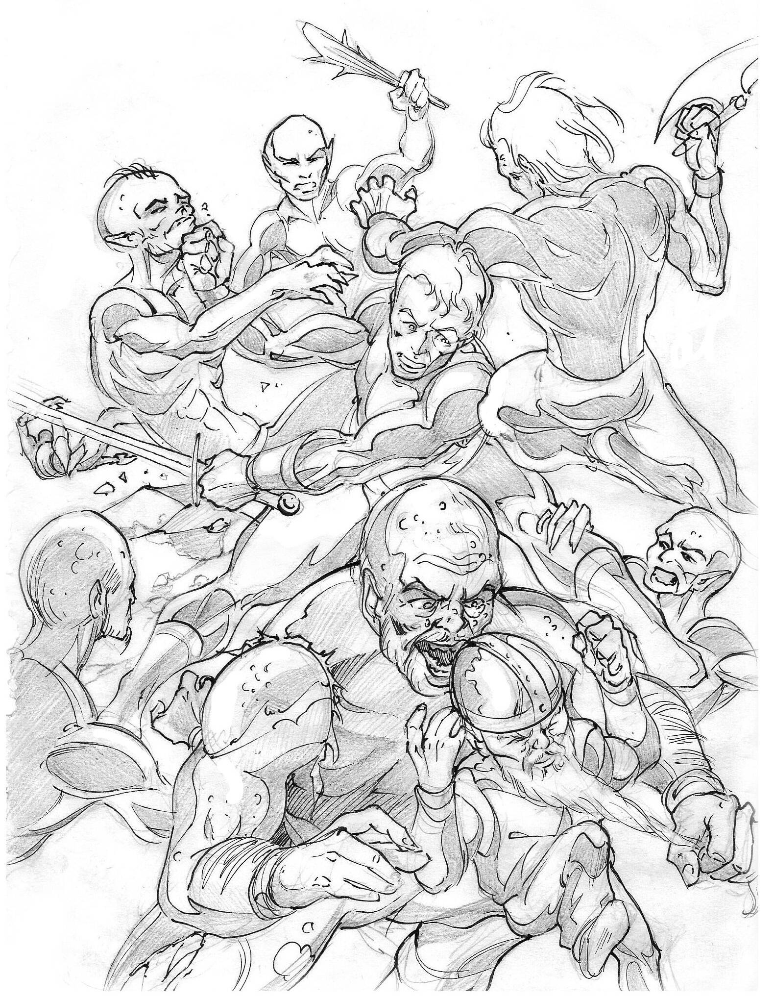
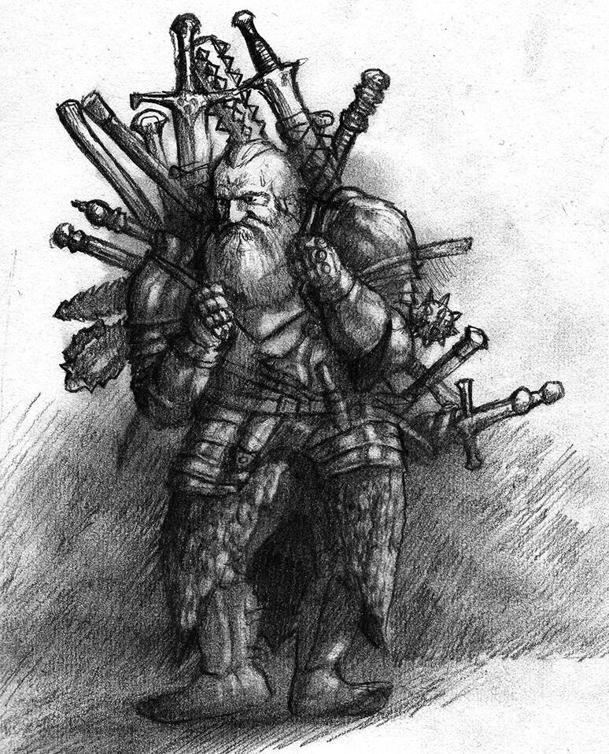

# BIND
<!--

# Dependencies

- pdflatex (loads of packages)
- git-lfs
- inkscape (for composing svg images)

# config/

The config directory is a subtree, so don't touch it unless you know what you're doing.

# compiling

> make

-->

|             Downloads          |         Questions             |
|:-------------------------------|:------------------------------|
| [Core Book][core download]     | [Wiki][wiki]                  | 
| [Character Sheet][cs]          | [Email an idea][issuesEmail] |
| [Reference Version][reference] | [Issues Board][board]         |

BIND is a fantasy tabletop RPG.  It's a free-as-in-freedom project, meaning that anyone can grab a copy of the source document and improve the rules, change the wording, add images, and then print it out, just like the original.

The following is a brief description of the project.
Those wanting to just have a game should use the download link above.
GMs who want a pre-made campaign setting should also have a look at [Adventures in Fenestra][aif].

For anyone wanting to make their own book, modifications, or otherwise understand how the mechanics work, have a look at the Wiki.

# Superfast Rules

- 6 Attributes: Strength, Dexterity, Speed, Intelligence, Wits and Charisma.
- Skills cover actions depending on what they're paired with.
  * Intimidation = Strength + Deceit.
  * Lies = Charisma + Deceit.
- Roll 2D6 + Attribute + Skill to succeed at standard Target Number 7.
- Combat is tactical.
  * Initiative is based on action-points.
  * The Combat Skill is divided between attack, defence and initiative.
  * Fate Points allow Damage to be avoided.
- Magic gets you multiple spells per level in a magic sphere
  * Spend MP to cast.
  * No healing magic.
  * Highest level of a sphere has to be cast slowly.
- Background is created by spending Story Points.
  * Spend 1 point to say you've learnt a language.
  * Spend 3 points to add an ally with martial ability.
  * Spend 4 points to bring in an all-powerful mage from your past.

# Parsimony

Parsimony means getting the same results with fewer steps.
As an example, you could represent a character's strength by saying 'Strength 14', then create a table where those with a Strength of 14 get a +2 bonus.
A more parsimonious way to represent a character as having 'Strength +2' is to just mark it with '+2'.

Everything from backstory, through character creation and groups rolling to spot dangers has been created to get a resolution in the shorted possible real-world time.

## No Class

Players put their XP wherever they like, so there are no charts for what has to be bought next, and no levelling system.
A fighter is just someone with a good Combat score, and a Paladin is just a fighter with a little divine magic.

## Background as Stories

*No backstory required*, the game just starts.

...but then...

+ You can't imagine where to hunt down those bandits.  You spend 1 Story Point and declare that you know a local constable from your days in the King's Army who might know where to look for them.  Soon you're journeying South.
+ Spying the bandit's lair, you find they're heavily armed and dangerous.  You spend 2 Story Points and declare that one of the guards in another town is a war buddy, willing to join you in battle.
+ Two stories later, the party is destitute, and in dire need of food and weapons.  Spending 3 Story Points, you declare that your old war buddies and you found some loot, burried it nearby, and promised each other nobody would touch it until the heat was off, and it could be evenly distributed.

Story Points allow players to craft a story in-play, once they know the world they're in.
It also means that nobody has a boring backstory, because everything in your past is *directly* relevant to what you're doing in the current adventure.
You can throw all your Story Points out there at the start, declaring you have friends in high places and fabulous wealth, or lay out small pieces of your history to explain why you know certain languages, and introduce old friends.

...and most importantly, crafting a detailed backstory no longer requires any time spent - everyone creates their history on the fly.

## Character Creation

Players make randomly generated characters.  This stops the indecision and long reading which threatens to prevaricate a good games night by removing those decisions and the catalogue-perusal of classes and races.  Typically this can produce a full table of new characters in about fifteen minutes.

The book contains decision-based character creation as a set of alternative rules, rather than a default.

## Abilities

The abilities are parsimonious, providing the standard inputs and outputs, but with fewer variables.  For example, 'Deceit' is used for both intimidation and lies, depending upon what it's paired with.  This gives Player Characters different scores for intimidating and lying, but with fewer skills to keep track of:

|                  | **Strength** (2)                    | **Dexterity** (-1)                                | **Speed** (0)                                 | **Intelligence** (1)            | **Wits** (-1) | **Charisma** (1) |
|:-----------------|:------------------------------------|:--------------------------------------------------|:----------------------------------------------|:--------------------------------|:-----------------------|:---|
| **Academics** +1 | giving a speech to a large crowd: 3 | forging a signature: 0                                  | sorting coins: 1                              | remembering facts: 2            | outsmarting someone: 0 | storytelling: 2 |
| **Deceit** +3    | intimidating an opponent: 5         | sliding a knife up to someone's neck unnoticed: 2 | charging at someone to intimidate them: 3     | crafting a clever ruse: 4       | coming up with a quick lie: 2         | making a false friend: 4 |
| **Vigilance** +3 | keeping watch all night: 5          | finding a door in the darkness: 2                 | racing through town to find a missing mage: 3 | investigating a murder scene: 4 | noticing an assassin lying in wait: 2 | finding which gentleman at court has a problem with the Duke: 4 |

# Tactics

Combat starts! You can put your combat-points into *Strike* to hit opponents better, or *Evasion* to stay safe.  You decide to go for *Strike* as bandits spring from the bushes, then roll for Initiative.

| The Count    | Health          | Actions                                                            |
|:------------:|:---------------:|:-------------------------------------------------------------------|
| Initiative 9 | `8 HP`, `10 FP` | You spend 2 Initiative to protect the priest from harm             |
| Initiative 8 | `8 HP`, `10 FP` | The bandits spend 2 Initiative to move towards you. The priest spends 6 Initiative to attack with a staff. |
| Initiative 7 | `8 HP`, `10 FP` | You spend 6 Initiative to attack,  and slash a bandit's arm open.  |
| Initiative 6 | `8 HP`, `2 FP`  | 2 bandits attack with knives, costing 4 Initiative.  Another two attack with swords, costing 6 Initiative.  You roll to defend against each one, and each defence costs 2 Initiative. You go from Initiative 1, to -2, then down as you continue to defend. One bandit hits, and you lose 8 Fate Points. |
| Initiative 5 | `8 HP`, `2 FP`  | Your companion spends 6 Initiative to attack with an axe, and  finishes off the bandit you wounded. |
| Initiative 4 | `8 HP`, `2 FP`  |                                                                    |
| Initiative 3 | `8 HP`, `2 FP`  |                                                                    |
| Initiative 2 | `6 HP`, `0 FP`  | The two bandits with knives attack again. The priest spends 6 Initiative and knocks one over the head, but not before you get 4 Damage and a nasty wound on the arm. |
| Initiative 1 | `6 HP`, `0 FP`  |                                                                    |

The round ends, a new one starts, and this time you decide to go defensive.  Once the battle's over you get back 4 Fate Points, putting you on `6 HP`, and `4 FP`.

## Multiprocessing

As you can see, players roll to defend attacks rather than a GM rolling to attack.  This keep things moving fast, even when there are 6 attackers for every player.

## Fatepoints

Nobody magically heals, so wounds stick around for the duration of the game.
To level the dangers, players get a number of Fate Points, which they can lose instead of Hit Points.
Fate Points heal quickly, while Hit Points do not.

Healing Fate Points after an encounter means players don't constantly fear death after a single wound, but still have to carry that wound.
It also provides a plausible fear-mechanic, as players with few Fate Points have a good reason to fear for their characters.

## Side Quests

Foreshadowing, multiple plot-arcs, and keeping track of the lot over the long term can be difficult.
Who has time for that with study and a job?
Side Quests are here to help the GM and make sure that no GM comes unprepared, even if they haven't actually prepared anything.

An individual Side Quest is a simple story in a few parts:

- the players hear of a mad mage,

- the players encounter a monster made by the mad mage,

- and finally the players find a village destroyed by the mad mage.

That last part can be repeated until the characters confront the mage.
Details of the mad mage's lair will be given, so the players can track her down when ready.

Multiple quest parts intermingle, and sometimes two parts occur simultaneously.
The result is a fast-paced story, where the plot is always jumping out *at* the party.

## Magic

Spellcasters spend Mana to cast spells.  They generally have 2-6 points of Mana and a few types of spells, so you can avoid extended book-keeping.

A caster with Aldaron 2 and Fate 3 would have the following spells to choose from.  Level 1 spells cost 1 Mana Point, and level 2 spells cost 2 Mana Points.

| Level | Fate                                                     | Aldaron                              |
| :----:|:---------------------------------------------------------|:-------------------------------------|
| 1     |  Curse an enemy or ask for divine guidance.              | Calm an animal. Freeze water.        |
| 2     | Heal a companion's Fate Points.                          | Summon mist.  Create blinding light. |
| 3     | Request minor divine intervention. Boost someone's luck. |                                      |

## Larger World

[Adventures in Fenestra](https://gitlab.com/bindrpg/aif) contains a GM's guide, Bestiary, a setting, and mini-adventures.

# Project Notes

## Installation

Dependencies:

- git
- git-lfs
- inkscape
- pdflatex (lots of packages)

Install by typing `make`, in the directory, and the Makefile should do the rest.

## LaTeX

This thing's written in LaTeX, a magical document format where you describe the layout to the computer, then the computer does the layout for you.
The first time this was written in a standard editor, the persistent revisions added up to months of formatting and reformatting.
If you ever need to write a long work involving anything more than a series of words: do yourself a favour and learn LaTeX.
The basics just take an afternoon.

## Getting Involved

If you want to get involved, there are a number of ways to contribute:

- Emailing ideas [here][issuesEmail].

- Posting ideas on the [board][board].

- Playtesting.

- Contributing svg art.

- Writing to me, and if you like how the book's going, join as a dev.

- Or if you don't like how I'm handling the book, fork it and make your own.

[core download]: https://ttrpgs.org/share/bind.pdf
[reference]: https://ttrpgs.org/share/bind_ref.pdf
[wiki]: https://gitlab.com/bindrpg/core/-/wikis/home
[aif]: https://gitlab.com/bindrpg/aif
[cs]: https://ttrpgs.org/share/bind_cs.ods
[board]: https://gitlab.com/bindrpg/core/issues
[issuesEmail]: mailto:incoming+bindrpg-core-16324687-issue-@incoming.gitlab.com
